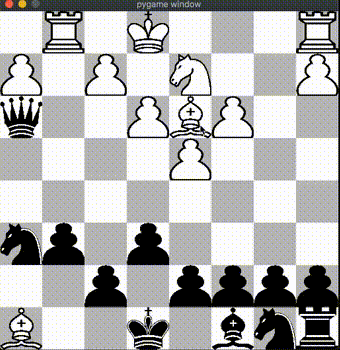

# Python Chess
A GUI chess game including a simple AI, all written in Python.
<p align="center">

</p>

## Index
1. [About](#about)
2. [Demo](#demo)
3. [Usage](#usage)
    * [Installation](#installation)
    * [Commands](#commands)
4. [Credits](#credits)

<a name="about"></a>
## About
This project includes a full chess engine, gui engine, and an AI engine. The AI engine utilizes the minimax and alpha beta pruning algorithms.

<a name="demo"></a>
## Demo
| Human vs Human   | Human vs AI (AI is controlling black)  |
|:----------------------|:------------------|
| |  |
| [First full human vs human test run](https://www.youtube.com/watch?v=yuVbVM19GIY) | [First full human vs AI test run](https://www.youtube.com/watch?v=npUyYXWPDfI) |

<a name="usage"></a>
## Usage
To install this project, make sure you have the correct version of Python and Pygame. 

<a name="installation"></a>
### Installation
- Switch to Python3.
- Follow the code below to create virtual environment and install the necessary libraries.

```
git clone https://github.com/boosungkim/python-chess.git
cd python-chess
python3 -m venv venv
source venv/bin/activate
pip install pygame
```

<a name="commands"></a>
### Commands
- To start the game, run `python3 -W ignore chess_gui.py`, then select the game mode you want to play in the command line.
- To undo a move, press `u`.
- To reset the board, press `r`.

<a name="credits"></a>
## Credits
All three engines were written by Boo Sung Kim, but the move log and the GUI engine code was initially inspired by Eddie Sharick and the AI engine was originally inspired by Sebastian Lague's pseudocode.

